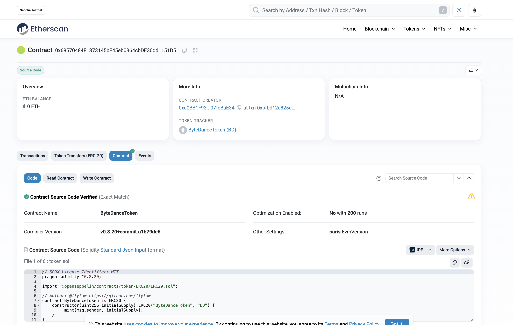
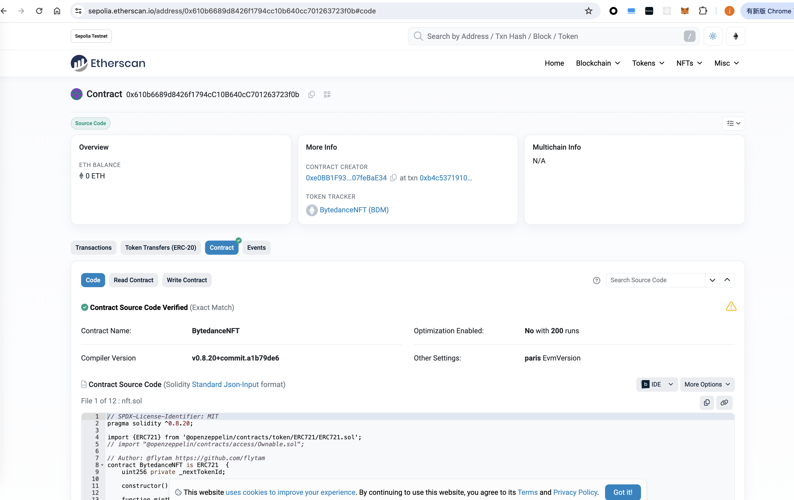
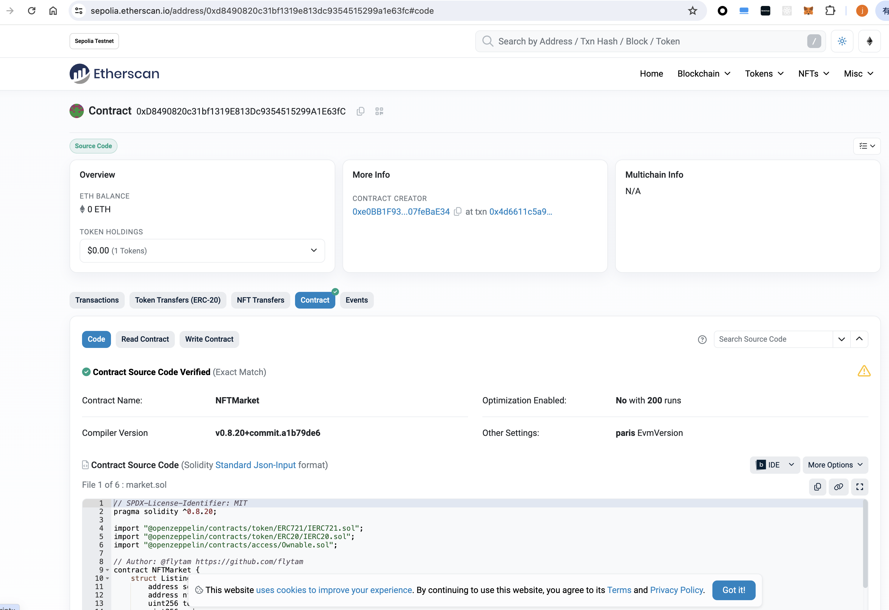
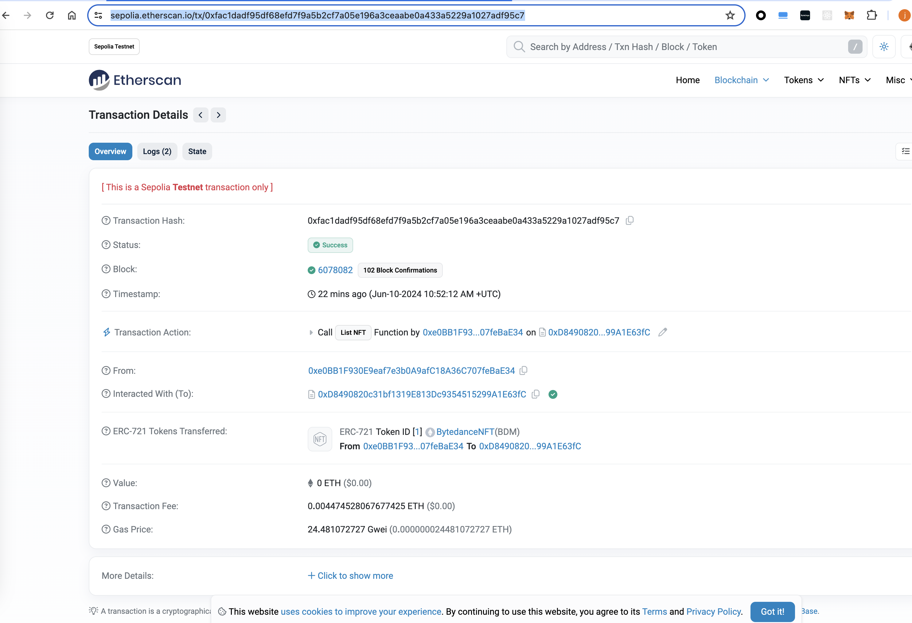
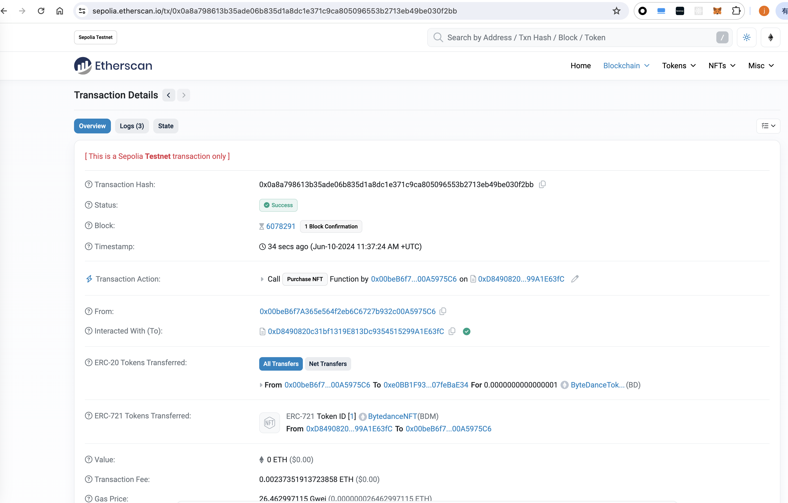

# Task 3

[https://github.com/flytam](https://github.com/flytam)

## ERC20 合约地址

[0x68570484F1373145bF45eb0364cbDE30dd1151D5](https://sepolia.etherscan.io/address/0x68570484f1373145bf45eb0364cbde30dd1151d5)

## ERC721 合约地址
[0x610b6689d8426f1794cC10B640cC701263723f0b](https://sepolia.etherscan.io/address/0x610b6689d8426f1794cc10b640cc701263723f0b#code)

## Market 合约地址
[0xD8490820c31bf1319E813Dc9354515299A1E63fC](https://sepolia.etherscan.io/address/0xd8490820c31bf1319e813dc9354515299a1e63fc#code)

## 操作哈希
- 上架 NFT

[0xfac1dadf95df68efd7f9a5b2cf7a05e196a3ceaabe0a433a5229a1027adf95c7](https://sepolia.etherscan.io/tx/0xfac1dadf95df68efd7f9a5b2cf7a05e196a3ceaabe0a433a5229a1027adf95c7)

- 购买 NFT

[0x0a8a798613b35ade06b835d1a8dc1e371c9ca805096553b2713eb49be030f2bb](https://sepolia.etherscan.io/tx/0x0a8a798613b35ade06b835d1a8dc1e371c9ca805096553b2713eb49be030f2bb)

----

## TestAccount

- 0xe0BB1F930E9eaf7e3b0A9afC18A36C707feBaE34 (main)
- 0x00beB6f7A365e564f2eb6C6727b932c00A5975C6 (sub)

